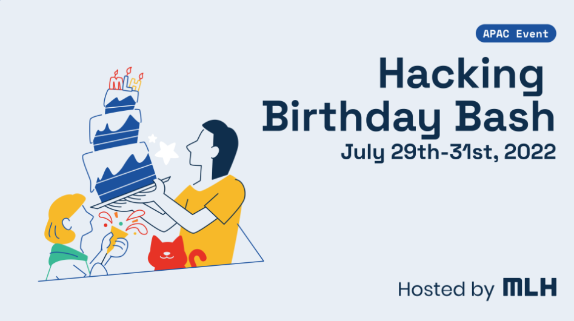

### Hacking-Birthday-Bash

Official submission to Hacking Birthday Bash organised by MLH 2022. 

Check out the project video here TBA - [YouTube]()

## Inspiration💡
Happy Birthday MLH! We feel proud to be taking part in hackathons by an organisation that has consistently helped hackers be better. Participating in multiple weekend hackathons has helped us become better hackers whilst having fun in learning new technologies.

This weekend, in order to give back to the community, we decided on taking 2 new hackers in our team and help them feel the fun in hacking. To start things off we decided on a stack that we all could equally contribute to, and set out parameters in which we could achieve our objectives. 
  

## What it does 🧭
Our Mobile application "Moodsings" is based off of a traditional game in India called "Antakshari". In this game the rules are simple:

1. You have to sing a song 
2. The song that you sing has to start with the last syllable the previous song ended with. 
 
For example: If the last song ended with the sound "Na" then your song should start with a word whose first syllable is phoenetically similar to "Na".

The USP of our project is to play a similar game, but instead of focussing on the syllable of the song, we focus on the mood that our app recommends the user to sing the song about. 

## How the App Looks 🤜🔥🤛

## How we built it 🔧

Our solution, was built with ❤️ using Flutter, Python, Machine learning Algorithms and Voice Recognition. Special Mention to Git and GitHub for providing us with the tools we needed to collaborate in real time whilst working from different regions. 

## Tech Stack 🔨
1. Flutter
2. Dart
3. Python
4. Machine Learning
5. Voice Recognition
6. Git
7. Github

## Challenges we ran into 🏃‍♂️

1. Integration of the ML model with a flutter application was challenging to say the least. 
2. To have the voice recognition work in near real time whilst the model was running in the background is a challenge we are yet to solve.
3. Incorporating Multiple local languages was a major challenge, for starters we programmed this to run on "English" only. 

## Accomplishments that we're proud of 🏅
1. TBA

## What we learned 🧠
1. Voice recognition using machine learning
2. Integration of ML models with flutter
3. Helping our fellow teammates join the hacking revolution by MLH!
## What's next ⏭
 1. For future additions we aim to dynamically process the voice input in order to show scores based on user's performance. 

## Collaborators 🤖

Only developers.
| Name      | GitHub Profile     |
| :------------- | :----------: |
|  Gyanesh Samanta   | [GitHub](https://www.github.com/gyanesh-samanta-123) |
|  Eshaan Bhardwaj   | [GitHub](https://github.com/Eshaan-B) |
|  Adarsh Sailendra   | [GitHub](https://github.com/Adarsh-gif-crypt) |
|  Reeti Jha           | [GitHub](https://github.com/Reeti1605) |

